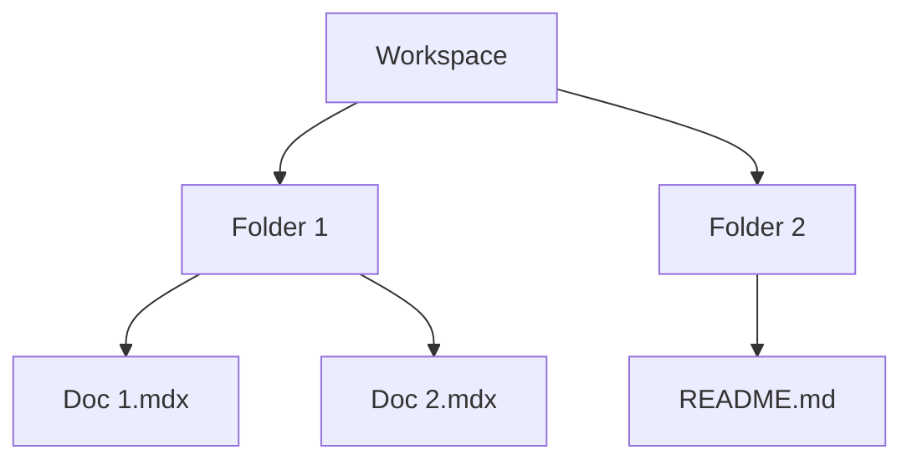

## Overview

ILA provides powerful tools for creating, organizing, and sharing documentation. You streamline your team's workflow with intuitive document creation, flexible project structures, advanced search, and rich media support. These features help you build comprehensive knowledge bases efficiently.

<Columns cols={2}>
  <Card title="Document Creation" icon="edit-3" href="#document-creation">
    Create and edit docs with real-time collaboration.
  </Card>
  <Card title="Project Organization" icon="folder" href="#project-organization">
    Structure projects with folders and workspaces.
  </Card>
  <Card title="Search and Filtering" icon="search" href="#search-filtering">
    Find content quickly with powerful queries.
  </Card>
  <Card title="Media Support" icon="image" href="#media-support">
    Embed images, videos, and interactive elements.
  </Card>
</Columns>

## Document Creation and Editing

You create new documents instantly from the dashboard. ILA supports rich text, Markdown, and MDX editing modes. Real-time collaboration allows multiple users to edit simultaneously, with version history to track changes.

<Callout kind="tip">
  Enable live previews to see formatted output as you type.
</Callout>

Follow these steps to create your first document:

<Steps>
  <Step title="Start a New Doc" icon="plus">
    Click the `+ New Document` button in your workspace.
  </Step>
  <Step title="Choose Editor" icon="edit">
    Select Markdown or rich text mode.
  </Step>
  <Step title="Add Content" icon="type">
    Write your content and invite collaborators via `@mention`.
  </Step>
  <Step title="Publish" icon="upload">
    Save and publish to share with your team.
  </Step>
</Steps>

<CodeGroup tabs="Markdown,Rich Text">
  ```markdown
  # Welcome to ILA

  ## Quick Start

  - Install via npm
  - Configure your workspace
  - Start documenting
  ```
  ```html
  <h1>Welcome to ILA</h1>

  <h2>Quick Start</h2>
  <ul>
    <li>Install via npm</li>
    <li>Configure your workspace</li>
    <li>Start documenting</li>
  </ul>
  ```
</CodeGroup>

## Project Organization Tools

Organize documents into workspaces, folders, and tags. You nest folders deeply and use tags for cross-project categorization. Permissions control access at the folder level.

<Tabs>
  <Tab title="Workspaces" icon="layers">
    Create isolated spaces for different projects.

    ```javascript
    // API example to create workspace
    const response = await fetch('https://api.example.com/v1/workspaces', {
      method: 'POST',
      headers: { 'Authorization': 'Bearer YOUR_TOKEN' },
      body: JSON.stringify({ name: 'My Project' })
    });
    ```
  </Tab>
  <Tab title="Folders" icon="folder">
    Nest documents for better navigation.

    <ParamField path="folderId" param-type="string" required="true">
      Unique folder identifier.
    </ParamField>
  </Tab>
</Tabs>



## Search and Filtering Capabilities

ILA's search indexes all content, supporting full-text queries, filters by tag, date, and author. You refine results with advanced operators like `tag:api` or `after:2024-01-01`.

| Filter Type | Example Query | Description |
|-------------|---------------|-------------|
| Tag        | `tag:feature` | Documents tagged "feature" |
| Date       | `after:2024-10-01` | Recent updates |
| Author     | `author:alice` | Content by specific user |
| Path       | `path:api/*`  | API section docs |

<Expandable title="Advanced Search Tips" default-open="false">
  Combine filters: `tag:bugfix author:bob after:2024-09-01`.
  
  Use the API for programmatic search:

  <Request tabs="cURL,JavaScript">
    ```bash
    curl "https://api.example.com/v1/search?q=authentication&filter=tag:security" \
      -H "Authorization: Bearer YOUR_TOKEN"
    ```
    ```javascript
    const results = await fetch('https://api.example.com/v1/search?q=authentication&filter=tag:security', {
      headers: { 'Authorization': 'Bearer YOUR_TOKEN' }
    }).then(r => r.json());
    ```
  </Request>
</Expandable>

## Media and Embed Support

Embed images, videos, diagrams, and iframes directly. ILA optimizes media for fast loading and supports responsive layouts.

```jsx
<Image
  src="https://example.com/screenshot.png"
  alt="ILA Dashboard Overview"
  width="800"
  height="400"
/>
```

<Callout kind="info">
  All embeds are sanitized for security. Use `{https://your-webhook-url.com/webhook}` for custom webhooks.
</Callout>

These features integrate seamlessly, letting you build professional documentation sites. Explore [quickstart](/quickstart) for hands-on setup.