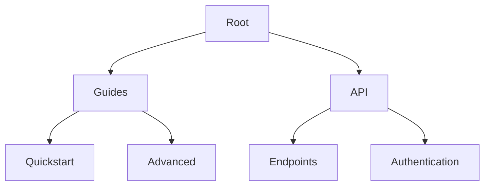

## Hierarchical Page Structures

Organize your documentation into logical hierarchies to improve navigation and discoverability. ILA supports nested folders and pages, allowing you to create tree-like structures for complex projects.

Use the dashboard at `https://app.ila.com/docs` to manage your structure. Start by creating top-level folders for major sections like "Getting Started" or "API Reference".



<Callout kind="tip">
  Limit nesting to three levels deep to avoid overwhelming users.
</Callout>

<Steps>
  <Step title="Create Folders" icon="folder">
    Navigate to your workspace. Click the `+ New` button and select `Folder`. Name it descriptively, like `User Guides`.
  </Step>
  <Step title="Add Pages" icon="file-text">
    Inside a folder, click `+ New Page`. Choose `MDX` for rich documentation or `Markdown` for simple notes.
  </Step>
  <Step title="Reorder" icon="move">
    Drag pages or folders in the sidebar to adjust the hierarchy. ILA auto-generates navigation menus.
  </Step>
</Steps>

## Collaboration and Permissions

Invite team members to collaborate securely. Assign roles to control access levels.

<Tabs>
  <Tab title="Editor" icon="edit-3">
    Editors can create, edit, and delete pages. Ideal for content writers.
  </Tab>
  <Tab title="Viewer" icon="eye">
    Viewers read-only access. Perfect for stakeholders.
  </Tab>
  <Tab title="Admin" icon="shield">
    Full control, including user management and settings.
  </Tab>
</Tabs>

| Role    | Create Pages | Edit Pages | Delete Pages | Manage Users |
|---------|--------------|------------|--------------|--------------|
| Viewer  | No           | No         | No           | No           |
| Editor  | Yes          | Yes        | No           | No           |
| Admin   | Yes          | Yes        | Yes          | Yes          |

<Callout kind="alert">
  Review permissions regularly to prevent unauthorized changes.
</Callout>

## Version History and Revisions

ILA tracks every change automatically. Access history to revert mistakes or review contributions.

<Expandable title="View History" default-open="true">
  Right-click a page in the sidebar and select `View History`. Compare diffs side-by-side.

  ```tsx
  // Example diff view in ILA UI
  const changes = [
    { line: 1, old: 'Welcome', new: 'Hello World' },
    { line: 5, old: '', new: 'New feature added' }
  ];
  ```
</Expandable>

Use <kbd>Cmd</kbd>+<kbd>S</kbd> (Mac) or <kbd>Ctrl</kbd>+<kbd>S</kbd> (Windows) to save revisions manually.

<Steps>
  <Step title="Revert Changes" icon="undo">
    In history view, select a version and click `Restore`.
  </Step>
  <Step title="Compare Versions" icon="git-branch">
    Click `Compare` to see line-by-line diffs.
  </Step>
</Steps>

## Export and Sharing Options

Share your documentation externally without granting access.

<Columns cols={3}>
  <Card title="PDF Export" icon="file-text" href="#">
    Generate printable PDFs for offline use. Includes full hierarchy.
  </Card>
  <Card title="Markdown ZIP" icon="archive" href="#">
    Download all pages as a ZIP of `.mdx` files. Great for GitHub import.
  </Card>
  <Card title="Public Link" icon="share-2" href="#">
    Create read-only links. Track views and set expiration.
  </Card>
</Columns>

<CodeGroup tabs="CLI,API">
  ```bash
  ila export --project my-docs --format pdf --output docs.pdf
  ```
  ```javascript
  fetch('https://api.ila.com/v1/export', {
    method: 'POST',
    headers: { 'Authorization': 'Bearer YOUR_API_KEY' },
    body: JSON.stringify({ project: 'my-docs', format: 'zip' })
  });
  ```
</CodeGroup>

<Expandable title="Advanced Sharing">
  Embed pages via iframe: `<iframe src="https://app.ila.com/docs/embed/my-page" width="100%" height="600"></iframe>`. Customize with CSS variables matching your brand color `#3B82F6`.
</Expandable>